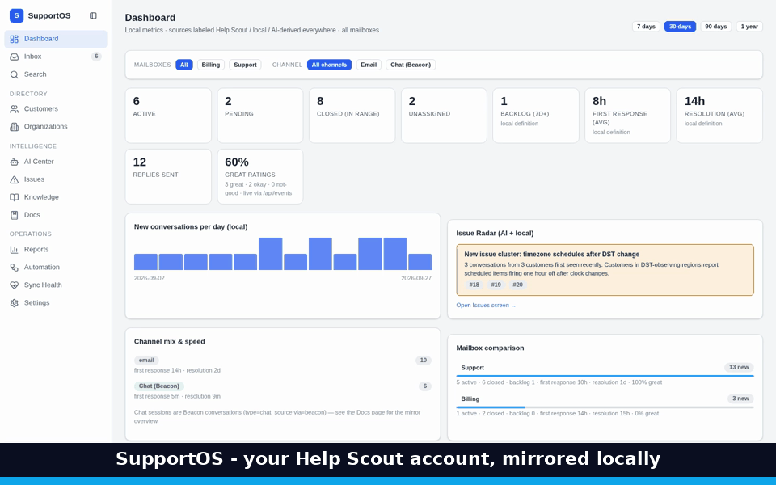
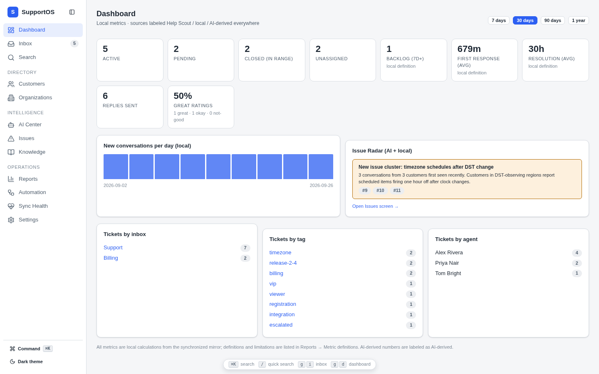
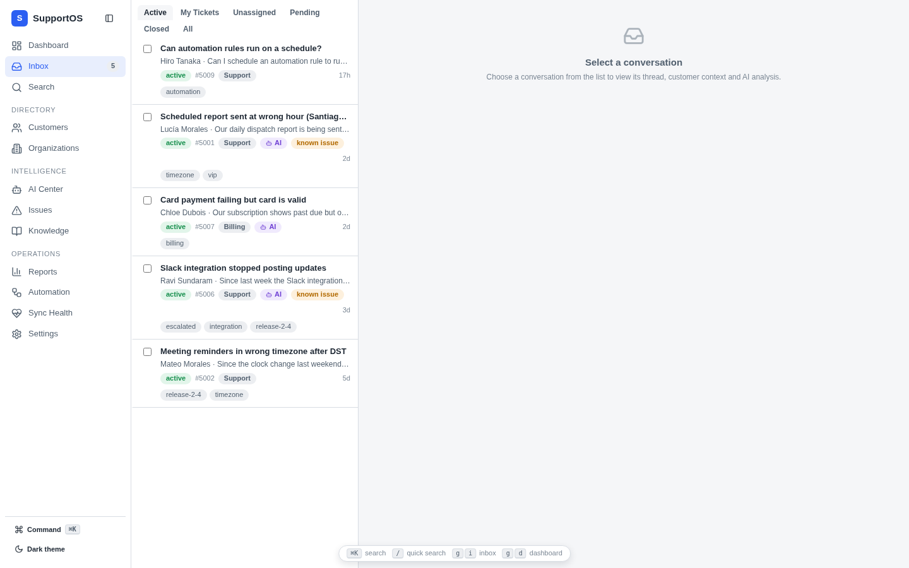
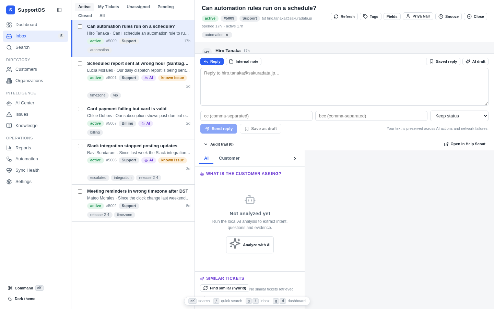
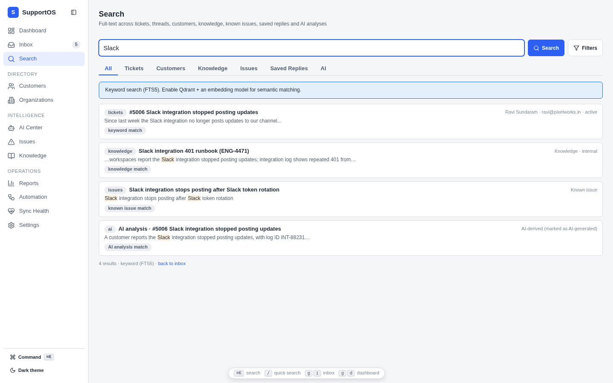
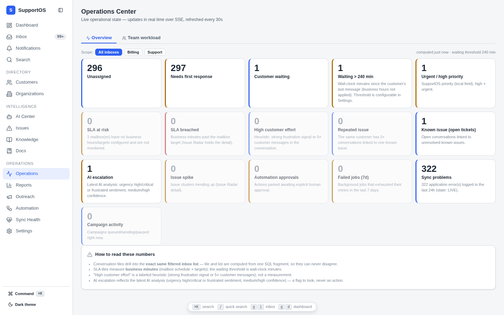
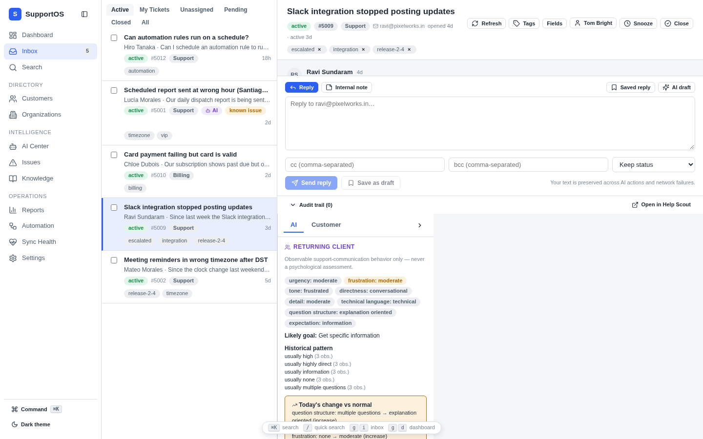
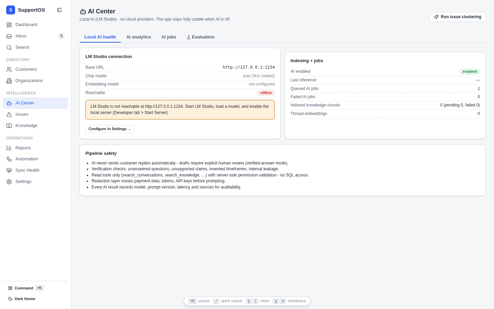
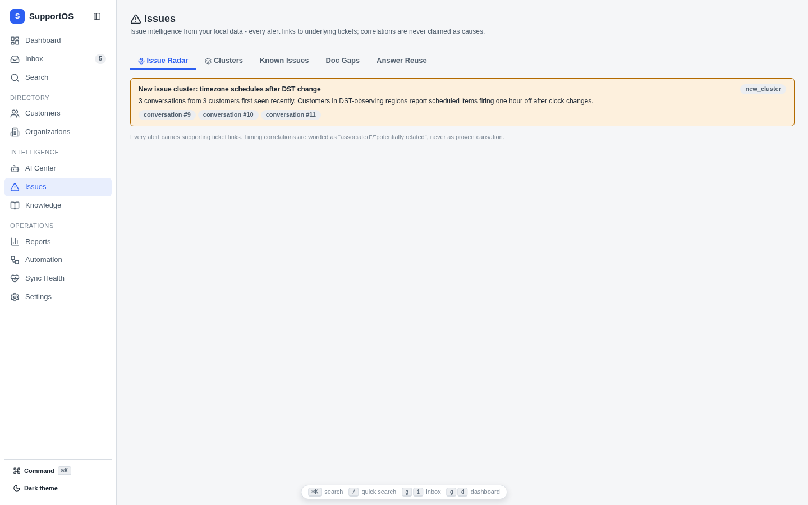

<div align="center">

# 🎧 SupportOS

### The local-first, AI-powered support operating system for your Help Scout mailbox

**Fast support tooling with a privacy guarantee: your customer data never leaves your machine.**

[](https://github.com/kimpearce888/supportos/actions/workflows/ci.yml)
[](docs/TESTING.md)
[](LICENSE)
[](package.json)
[](tsconfig.base.json)
[](docs/LOCAL-RUN.md)
[](https://github.com/kimpearce888/supportos/releases/latest)
[](CONTRIBUTING.md)

[What is SupportOS?](#-what-is-supportos) · [Why it exists](#-why-it-exists) · [Screenshots](#-see-it-in-action) · [Try it in 2 minutes](#-try-it-in-2-minutes) · [Features](#-features) · [Safety model](#-safety--trust-by-design) · [Docs](#-documentation)

</div>

---

## 🧭 What is SupportOS?

SupportOS is a **self-hosted help desk companion and support intelligence platform**. It mirrors your Help Scout mailbox into a local SQLite database on your own machine, then layers a professional support workspace on top:

- **⚡ Instant everything** — search your entire archive in milliseconds with local full-text search; no API round-trips, no rate limits, no spinners
- **🎧 A real support inbox** — a 3-pane workspace with every ticket operation you expect: reply, notes, assignment, tags, snooze, saved views, bulk actions
- **🖥️ Team operations** — a live Operations Center, workload & capacity, a notification center, @mentions and internal side threads
- **🤖 Local AI, when you want it** — an interactive copilot, evidence-backed draft replies, pre-send coaching and customer memory, all running against LM Studio on your machine; every bit of it is advisory — a human always decides
- **🔬 Support intelligence** — issue radar, incidents with impact analysis, client behavior signals, SLA reporting, a custom report builder
- **🔒 Privacy by physics** — no cloud AI, no telemetry, no data egress; the server binds to `127.0.0.1` by default

Help Scout remains the source of truth — SupportOS is the fast, private, intelligent layer on top of it.

---

## 📖 Why it exists

Every support team eventually hits the same wall. Your ticket archive — years of customer conversations, the issues they hit, the words they used, the fixes that worked — lives inside a SaaS tool you rent. Search is slow because every query round-trips to someone else's data center. Analytics are limited to whatever the vendor exposes. And the moment you want AI assistance, the obvious path means shipping your customers' emails, payment references and secrets to a third-party model API.

That's the trade nobody should have to make: **intelligence in exchange for privacy**. SupportOS exists because a support workspace can be fast, smart and *yours* — all three at once, on hardware you already own. The founding decision was a single question — *what if the whole mailbox lived in one local SQLite file?* — and everything after it followed: a mirror (not a replacement) of Help Scout, writes back through the official API with duplicate protection, AI that runs locally and is optional by design.

The project grew through 14 public releases to a completed roadmap — then deliberately stopped adding features: **v2.2.1 is a from-scratch independent audit that fixed 45 confirmed defects and added zero features**, because "works exactly as designed" matters more than the next shiny thing. The full release-by-release story is in [CHANGELOG.md](CHANGELOG.md), and the reasoning behind all 60 major design decisions is preserved in [docs/DECISIONS.md](docs/DECISIONS.md).

---

## 📸 See it in action

All screenshots are the **real application** running in demo mode (a simulated mailbox) — clone the repo and you'll see exactly this, in under two minutes.

**🎬 The 30-second tour — dashboard, inbox, client intelligence, docs search and a live CSAT rating arriving over Server-Sent Events:**

[](docs/demo.gif)

| | |
|---|---|
| [](docs/screenshots/dashboard.png) | [](docs/screenshots/inbox.png) |
| **Dashboard** — volume, response times and backlog at a glance | **Inbox** — views, filters, sanitized threads, customer + AI context panes |
| [](docs/screenshots/conversation.png) | [](docs/screenshots/search.png) |
| **Conversation** — thread view, rich composer, AI context pane | **Search** — one query across tickets, threads, customers, knowledge and issues |
| [](docs/screenshots/v180-operations-center.png) | [](docs/screenshots/client-intelligence.png) |
| **Operations Center** — the whole operation on 16 live tiles | **Client intelligence** — behavior signals with evidence, today vs. their norm |
| [](docs/screenshots/ai-center.png) | [](docs/screenshots/issues.png) |
| **AI Center** — local LM Studio health, job queue, analytics | **Issue Radar** — new/rising/recurring issue clusters with linked tickets |

More screenshots — campaigns, incidents, saved views, notifications, copilot, reports, knowledge — live in [docs/screenshots/](docs/screenshots/).

---

## ⚡ Try it in 2 minutes

No Help Scout account, no AI setup, no credentials needed:

```bash
git clone https://github.com/kimpearce888/supportos.git
cd supportos
npm install
cp .env.example .env        # then set LOCAL_DEMO_MODE=true in .env → no Help Scout account needed
npm run build
npm run start               # → http://127.0.0.1:3000
```

Demo mode spins up a simulated Help Scout mailbox (20 conversations across email and Beacon chat, 9 Docs articles, customers, tags, known issues, knowledge and sample AI analyses) and runs the **real sync engine** against it — nothing is mocked at the UI level, so you're evaluating the actual product. While you're there, open a second terminal and watch updates arrive live:

```bash
# Push a conversation event through the REAL webhook pipeline (HMAC → dedup → job → sync → SSE)
curl -X POST http://127.0.0.1:3000/api/demo/simulate-webhook \
  -H 'Content-Type: application/json' \
  -d '{"event": "convo.customer.reply.created"}'

# Or fire a CSAT rating
curl -X POST http://127.0.0.1:3000/api/demo/simulate-rating \
  -H 'Content-Type: application/json' \
  -d '{"conversationRemoteId": 105015, "rating": "great", "comments": "Shipped in the demo!"}'
```

<details>
<summary><b>🔌 Connect your real Help Scout mailbox</b></summary>

1. In Help Scout: **Your Profile → My Apps → Create My App** with redirect URI `http://localhost:3000/oauth/callback`
2. Put `HELPSCOUT_CLIENT_ID` / `HELPSCOUT_CLIENT_SECRET` into `.env` and set `LOCAL_DEMO_MODE=false`
3. `npm run start` → first-run wizard → **Connect Help Scout** (client-credentials is simplest for a personal integration)
4. Run the **initial sync** and watch per-resource checkpoints; the mirror is resumable after any restart
5. Optional: point Settings → AI at [LM Studio](https://lmstudio.ai) and/or local [Qdrant](https://qdrant.tech)

See [docs/API-INTEGRATION.md](docs/API-INTEGRATION.md) for the verified Help Scout API capability matrix.
</details>

<details>
<summary><b>🖥️ Optional: native desktop app (MSI / DMG / AppImage)</b></summary>

**The easy way:** download a ready-made installer from the [releases page](https://github.com/kimpearce888/supportos/releases) — Windows (MSI + NSIS `.exe`), macOS (universal DMG for Intel + Apple Silicon) and Linux (AppImage). Each package bundles the Node runtime and SQLite, so there is **nothing to install first** — no Node, no npm. Data lives in your user profile (`%APPDATA%` / `~/Library/Application Support` / `~/.local/share`).

**Build it yourself** (requires Rust via [rustup.rs](https://rustup.rs)):

```bash
npm ci
npm run desktop:build        # assembles resources + tauri build → installers in src-tauri/target/release/bundle/
```

The packaging pipeline bundles the server with esbuild, copies the one native module, downloads the official Node runtime and hands everything to Tauri — see [docs/DESKTOP.md](docs/DESKTOP.md). The same pipeline runs in CI on all three operating systems for every release.
</details>

<details>
<summary><b>🧑‍💻 Day-to-day development</b></summary>

```bash
npm run dev            # Vite dev client + tsx watch server, hot reload
npm run test:all       # 672 tests: unit + integration + e2e (never touches a real mailbox)
npm run lint           # ESLint (source, tests and config files)
npm run typecheck      # strict TS across server, client and config
```

Everyday running, ports, backup and troubleshooting are documented in [docs/LOCAL-RUN.md](docs/LOCAL-RUN.md) and [docs/TROUBLESHOOTING.md](docs/TROUBLESHOOTING.md).
</details>

---

## ✨ Features

### 📥 The support inbox

- **Full mailbox mirror** — conversations, threads, customers, organizations, tags, custom fields, attachments, ratings, saved replies, workflows and routing, synced with checkpoints and drift reconciliation; resumable after any restart
- **Ticket operations** — reply, drafts, internal notes, status, assignment, inbox moves, subject edits, merge-safe tags, snooze, scheduled replies, attachments and workflow runs; every write is audited and duplicate-protected
- **Universal search** — one query across tickets, thread text, customers, knowledge, known issues and AI analyses, with filters and exact ticket-number lookup; optional hybrid semantic search (local embeddings, optional Qdrant)
- **Saved Inbox Views** — structured condition trees (AND/OR groups, 22 condition kinds) compiled to parameterized SQL at open time, so "today" always means the day you open it
- **Powerful filters** — 14 activity fields × 15 date modes (DST-safe calendar days and exact rolling windows, labeled distinctly), response states and ages, all state in the URL
- **Priority & custom states** — a local priority and a configurable state layer with per-transition history and lifecycle metrics, layered over Help Scout status, never replacing it
- **Real-time by default** — CSAT ratings, webhook-pushed changes and notifications arrive over Server-Sent Events; no polling, no refresh

### 👥 Running the team

- **Operations Center** — 16 live tiles (unassigned, needs first response, waiting, SLA risk, urgent, AI escalations, failures…); every tile drills into the exact same filtered list that produced its count, so the number and the list can never disagree
- **Workload & capacity** — per-agent and per-team load with an explicit, configurable capacity model; suggested assignees are read-only recommendations with their reasoning exposed — nothing is ever reassigned automatically
- **Notification Center** — 15 notification types with per-type preferences, a live unread badge, source links and retention pruning
- **@mentions & side threads** — `@agent` / `@team` mentions with exact identity matching (never guessed), and internal-only collaboration threads that never touch the customer-visible conversation
- **Automation** — a local rules engine with read / non-destructive / higher-risk action tiers; higher-risk actions always wait for human approval

### 🤖 Local AI — optional, always advisory

All AI runs against **LM Studio on your machine** (OpenAI-compatible, zero data egress) and the app is fully useful without it:

- **Local Copilot** — ask *What is this customer asking? Have we seen this before? What solved previous cases?* — answered through an allowlisted read-only tool registry with machine-generated citations the model cannot fake
- **Verified drafts** — evidence-backed reply drafts plus a verification pass (unsupported claims, missed questions, internal leakage); **automatic sending is permanently OFF**
- **AI attributes** — intent, product, urgency, risk and more per conversation, in two layers: deterministic (zero AI, always available) and evidence-backed AI with honest unknowns; filterable and reportable everywhere
- **Pre-send coaching** — ten evidence-based checks in the composer (unanswered questions, missing acknowledgment, internal-leakage spans, preference mismatch…); advisory by construction — no code path can block the send
- **Customer memory** — composed at read time from the facts already in your database, every entry with source and evidence; psychological judgments are refused on write and quarantined on read, enforced in code
- **Translation & rewrites** — local-only translation with side-by-side review and cached results

### 🧠 Client Interaction Intelligence

Per-customer communication behavior, observable and evidence-linked — never personality claims:

- Current signals (urgency, directness, detail level, technical familiarity) with quoted evidence and a recency-weighted historical baseline
- "Today vs. their norm" change detection — spot an off day before it becomes an angry ticket
- Observed preferences with human overrides (a rep's correction always wins), support outcomes, effort scores and repeat-client playbooks

### 🚨 Issues, incidents & knowledge

- **Issue Radar** — new, rising and recurring issue clusters with linked tickets, known issues, doc-gap detection and answer-reuse candidates
- **Incidents** — first-class master issues with status/severity/owner, derived impact intelligence (affected customers and organizations, never ticket counts), and an append-only timeline
- **SLA & business hours** — per-mailbox schedules and targets; reports measure wall AND business minutes, DST-safe, with breach detection and at-risk alerts
- **Knowledge base** — a local knowledge mirror with customer-safe vs. internal visibility, freshness lifecycle (stale, review gaps, conflict candidates) and a gap engine that proposes candidates for human approval — nothing auto-publishes
- **Support graph** — relationships across customers, orgs, conversations, issues, incidents and knowledge, every edge carrying its provenance; only humans assert persisted edges

### 📣 Outreach

- **Segmentation** — contact-first segments (properties, tags with ALL/ANY/NONE semantics, support history, incidents, campaigns, custom objects) with per-customer "why selected" evidence; the deterministic engine always decides the recipient set — the model may suggest, never select
- **Campaigns** — individual Help Scout conversations per recipient through a rate-limited queue, frozen recipient snapshots with selection evidence, per-recipient lifecycle, duplicate-send protection, a Do-Not-Contact list and a full audit trail

### 📊 Reports & quality

- **Custom report builder** — 21 metrics × 14 dimensions with filters, date ranges and previous-period comparison; every metric ships its definition and limitations in the response itself
- **Dashboards** — multi-mailbox and channel-scoped, using the same deterministic SQL as single-mailbox views
- **Post-resolution QA** — deterministic per-conversation quality signals (back-and-forth, repeated information, handoffs, timing) plus an optional local-model tier, honestly separated
- **Effectiveness & friction** — response-style/outcome associations (association wording only, never causation claims) and six evidence-pinned friction detections, every finding citing thread ids and excerpts

### 🛠️ Your data, your rules

- **Custom objects** — your own typed records (Account, Deployment, Subscription…) with validated fields and relationship edges; user data is JSON validated at every write and structurally can never become SQL
- **Local connectors** — approved JSON/CSV/SQLite/HTTP sources with snapshot refresh and a fail-closed SSRF guard; each connector carries an explicit AI-visibility switch (default: AI cannot see it)
- **Encrypted sync** — optional multi-device sync via end-to-end encrypted `.sosync` bundles (AES-256-GCM + scrypt); no relay server exists by design
- **Backups & export** — verified backups with restore, CSV/JSON export, sync health screen and a first-run wizard
- **Comfort** — dark/light theme, keyboard shortcuts, a command palette (⌘K) and a proper 404

---

## 🔒 Safety & trust by design

Built for teams whose tickets contain **payment data, credentials and personal data**:

- **Automatic reply sending is permanently OFF** — AI drafts always require explicit human review and a human send action
- **Local-first networking** — the server binds to `127.0.0.1` by default, warns loudly before binding elsewhere, validates the Host header against DNS-rebinding, and keeps CORS localhost-only
- **Secrets stay server-side** — OAuth tokens live in the local database, never exposed to the browser
- **Redaction before AI** — payment data, tokens and API keys are scrubbed from every prompt and log line
- **Sanitized rendering** — untrusted ticket HTML is stripped of scripts, event handlers and `javascript:` URLs before render
- **Verified webhooks** — HMAC-SHA1 timing-safe signature checks, persist-first processing, hash deduplication
- **Write-protection pipeline** — every remote mutation: validate → auth → fresh-read → merge → write → confirm → persist → audit; idempotent sends that never auto-retry
- **AI evaluation mode stops EVERY remote write** — trial AI features with replies, notes, status, tags, moves and bulk actions all blocked
- **Behavior, never psychology** — the client intelligence vocabulary is fixed and observable; support health is operational facts with evidence, no aggregate score; the personality red line in customer memory is enforced in code
- **Independently audited, repeatedly** — every release since v1.2.0 ships after an audit that deliberately avoids the project's own tests; the v2.2.1 audit re-examined the entire project from scratch, fixed 45 confirmed defects with zero new features, and its 452-check black-box script is in the repo so you can re-run it yourself

The full model is documented in [SECURITY.md](SECURITY.md) and [docs/ARCHITECTURE.md](docs/ARCHITECTURE.md).

---

## 🏗️ Architecture

```
React 19 + Vite + TypeScript  ──►  Fastify 5 (TypeScript)  ──►  SQLite (WAL + FTS5)
        (dist/client)                      │                          │
                                          │                     repositories
        LM Studio (local AI) ◄────────────┤                          │
        Qdrant (local vectors) ◄──────────┤                     job queues
                                          ▼
                              HelpScoutProvider interface
                       ┌────────────────────┴──────────────────┐
             RealHelpScoutProvider                        FakeHelpScoutProvider
        (OAuth2 + v3 reads / v2 writes,                (deterministic simulator for
         rate-limited priority queue)                   demo mode + entire test suite)
```

A **modular monolith**: one Node process, one SQLite database, background workers. No microservices, no cloud dependencies, nothing to pay for at scale — see [docs/ARCHITECTURE.md](docs/ARCHITECTURE.md) and [docs/DECISIONS.md](docs/DECISIONS.md) (the reasoning behind all 60 major design decisions).

**Tech stack:** React 19 · TypeScript (strict) · Fastify 5 · SQLite (WAL + FTS5) · Zod · TanStack Query · Zustand · Vite · Vitest · optional LM Studio / Qdrant / Tauri

---

## 🤔 FAQ

<details>
<summary><b>Who is SupportOS for?</b></summary>

Support teams (solo agents through mid-size departments) using **Help Scout** who want faster search, support analytics and AI assistance **without sending customer data to a cloud AI vendor**. Also great for privacy-regulated environments (GDPR, HIPAA-adjacent, finance) where "no data leaves the machine" is a requirement, not a preference.
</details>

<details>
<summary><b>Does it replace Help Scout?</b></summary>

No — it complements it. Help Scout remains the authoritative mailbox (agents can keep using Help Scout's own UI and mobile app). SupportOS mirrors it locally and adds an intelligence + speed layer. Every write goes back through Help Scout's official API with duplicate protection and full auditing.
</details>

<details>
<summary><b>Is my customer data really never sent to the cloud?</b></summary>

Yes. Sync traffic goes only to Help Scout (your own mailbox). AI runs against **LM Studio on your machine** — no OpenAI, no hosted inference. Semantic search (optional) runs against a **local Qdrant** instance. There is no telemetry, analytics beacon or crash reporter in SupportOS.
</details>

<details>
<summary><b>What if LM Studio / Qdrant aren't running?</b></summary>

The app is fully useful without AI: search, analytics, issue radar (keyword-based), ticket operations and reports all work — the AI layer degrades gracefully and says so honestly in the AI Center. Client Interaction Intelligence also has a deterministic engine that works entirely without AI.
</details>

<details>
<summary><b>Does Client Interaction Intelligence profile people psychologically?</b></summary>

No — by design and by enforcement. It reports **observable support-communication behavior only** (tone, directness, detail, technical language, urgency/frustration cues), drawn from a fixed vocabulary so personality labels are structurally impossible. Every significant observation carries evidence; one angry email never becomes a permanent label. See [docs/CLIENT-INTELLIGENCE.md](docs/CLIENT-INTELLIGENCE.md).
</details>

<details>
<summary><b>How is this tested?</b></summary>

**672 automated tests** (unit / integration / e2e) run in CI on every push, alongside lint, strict typecheck, a production build and a real demo-mode boot check. The suite is architected so **no test can ever send a real message**. On top of that, every release since v1.2.0 ships after an independent audit that deliberately avoids the project's own tests — the v2.2.1 audit included a human-like browser pass, and its 452-check black-box script ([`scripts/audit-phase1.mjs`](scripts/audit-phase1.mjs)) is in the repo so you can re-run it against your own instance. See [docs/TESTING.md](docs/TESTING.md).
</details>

<details>
<summary><b>Can I use it offline?</b></summary>

Yes for everything local: the mirror, search, analytics, knowledge base and previously generated AI outputs all work offline. Sync and new remote writes naturally need connectivity to Help Scout.
</details>

---

## 🗺️ Project history

The original roadmap is **complete**: 48 phases shipped across v1.0.0 → v2.2.0 (mirror → inbox → intelligence → collaboration → workspace → quality → memory), followed by **v2.2.1**, a zero-new-features audit release that fixed 45 confirmed defects in what already existed.

- The release-by-release story, with every fix and design note: [CHANGELOG.md](CHANGELOG.md)
- The logic behind all 60 major design decisions: [docs/DECISIONS.md](docs/DECISIONS.md)

Ideas and PRs welcome — see [CONTRIBUTING.md](CONTRIBUTING.md).

---

## 📚 Documentation

| Doc | Contents |
|---|---|
| [docs/LOCAL-RUN.md](docs/LOCAL-RUN.md) | Everyday running: dev, production and demo mode |
| [docs/API-INTEGRATION.md](docs/API-INTEGRATION.md) | Verified Help Scout v2/v3 API usage, capability matrix, known limitations |
| [docs/AI-SETUP.md](docs/AI-SETUP.md) | LM Studio + Qdrant setup and the AI pipeline |
| [docs/ARCHITECTURE.md](docs/ARCHITECTURE.md) | System design, data flow, provenance model |
| [docs/DECISIONS.md](docs/DECISIONS.md) | The decision log — the reasoning behind every major choice |
| [docs/CLIENT-INTELLIGENCE.md](docs/CLIENT-INTELLIGENCE.md) | Client Interaction Intelligence: design, safety model, API |
| [docs/DESKTOP.md](docs/DESKTOP.md) | Desktop packaging: installers, the bundled-runtime design, building your own |
| [docs/INSTALL-WINDOWS.md](docs/INSTALL-WINDOWS.md) | Windows installation incl. the Tauri desktop build |
| [docs/BACKUP-RESTORE.md](docs/BACKUP-RESTORE.md) | Backups, restore, CSV/JSON export |
| [docs/TESTING.md](docs/TESTING.md) | Test philosophy and quality gates |
| [docs/TROUBLESHOOTING.md](docs/TROUBLESHOOTING.md) | Common problems and fixes |
| [CHANGELOG.md](CHANGELOG.md) | Release history |

---

## 🤝 Contributing & support

- **Bug reports and feature requests:** [open an issue](https://github.com/kimpearce888/supportos/issues) — please include steps to reproduce (demo mode repros are gold)
- **Pull requests:** welcome! Run the [quality gates](CONTRIBUTING.md) first (`lint`, `typecheck`, `test:all`, `build`) — CI enforces them
- **Security reports:** see [SECURITY.md](SECURITY.md) — please use private vulnerability reporting rather than public issues

If SupportOS saves your team time, consider **starring the repository** — it helps other support teams find a privacy-first option.

---

## 📄 License

Released under the [MIT License](LICENSE).

*Help Scout is a trademark of Help Scout, Inc. SupportOS is an independent, open-source integration and is not affiliated with or endorsed by Help Scout.*
